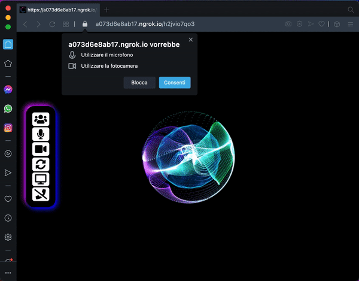

# mirotalk

`A free WebRTC browser-based video call and screen sharing`

[//]: https://img.shields.io/badge/<LABEL>-<MESSAGE>-<COLOR>

[](https://www.linkedin.com/in/miroslav-pejic-976a07101/)

[](https://www.paypal.com/donate?hosted_button_id=UX54YTCEG9GL4)
[](https://github.com/miroslavpejic85/mirotalk)
[](https://github.com/prettier/prettier)
[](https://gitter.im/mirotalk/community?utm_source=badge&utm_medium=badge&utm_campaign=pr-badge)

[//]: https://www.mirotalk.com

Powered by `WebRTC` using google STUN and [numb](http://numb.viagenie.ca/) TURN infrastructure. `mirotalk` provides video quality and latency simply not available with traditional technology.

[//]: #

<br>



## Features

- RoomUrl Sharing
- WebCam (front - rear)
- Audio
- Screen Sharing
- No download required, entirely browser based
- Direct peer to peer connection ensures lowest latency

## Quick start

- You will need to have [Node.js](https://nodejs.org/it/) installed, this project has been tested with Node version 12.X
- Clone this repo

```bash
git clone git@github.com:miroslavpejic85/mirotalk.git
cd mirotalk
```

## Set up credentials

- Copy .env.template to .env `cp .env.template .env`
- Create an account on http://numb.viagenie.ca
- Get your Account USERNAME and PASSWORD
- Fill in your credentials in the `.env` file

## Install dependencies

```js
npm install
```

## Start the server

```js
npm start
```

- Open `http://localhost:3000` in browser
- If you want to use a client on another computer/network, make sure you publish your server on an HTTPS connection.
  You can use a service like [ngrok](https://ngrok.com/) for that. (`ngrok http 3000`)

## Contributing

Pull Requests are welcome! :slightly_smiling_face:

Please run [prettier](https://prettier.io) on all of your PRs before submitting, this can be done with `prettier --write mirotalk/` in the project directory.

For communication we use Gitter Chat which can be found here:

[](https://gitter.im/mirotalk/community?utm_source=badge&utm_medium=badge&utm_campaign=pr-badge)
