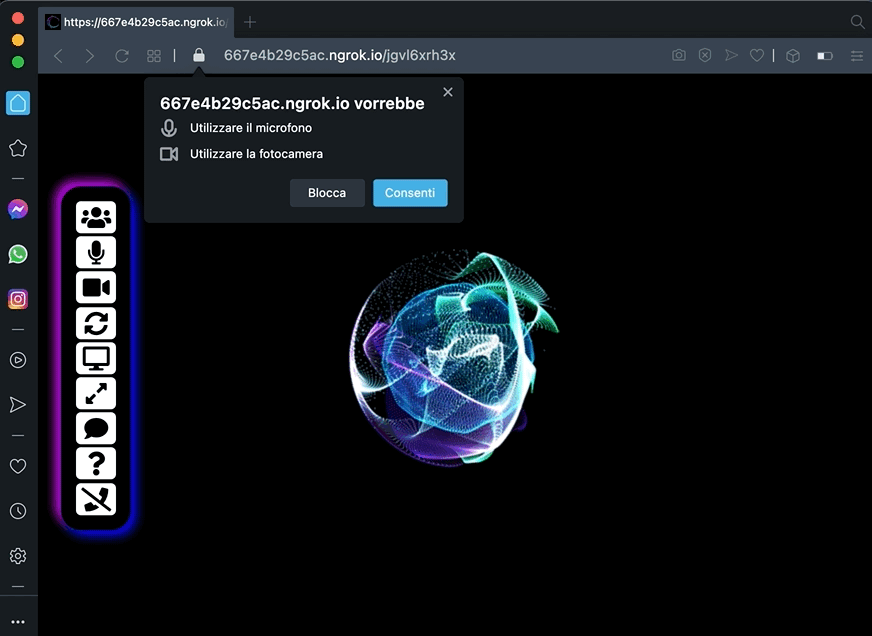

# mirotalk

🚀 `A free WebRTC browser-based video call and screen sharing` 🚀

<br>

[//]: https://img.shields.io/badge/<LABEL>-<MESSAGE>-<COLOR>

[](https://www.linkedin.com/in/miroslav-pejic-976a07101/)

[](https://www.paypal.com/donate?hosted_button_id=K2SG47W4R6ZZN)
[](https://github.com/miroslavpejic85/mirotalk)
[](https://github.com/prettier/prettier)
[](https://gitter.im/mirotalk/community?utm_source=badge&utm_medium=badge&utm_campaign=pr-badge)

Powered by `WebRTC` using google Stun and [numb](http://numb.viagenie.ca/) Turn. `mirotalk` provides video quality and latency not available with traditional technology.

Open the app in one of following **supported browser**

[//]: #


## https://mirotalk.herokuapp.com/

<br>



## Features

- Room Url Sharing (share to your friends, wait them to join)
- WebCam Streaming (Front-Rear)
- Audio Streaming
- Screen Sharing
- Quick Message
- Chat Room
- Full Screen Mode
- Change Theme
- Select Audio Input-Output & Video source (beta)
- Right click on Video elements for more options
- No download required, entirely browser based
- Direct peer to peer connection ensures lowest latency

## Quick start

- You will need to have [Node.js](https://nodejs.org/it/) installed, this project has been tested with Node version 12.X
- Clone this repo

```bash
git clone git@github.com:miroslavpejic85/mirotalk.git
cd mirotalk
```

## Set up credentials

- Copy .env.template to .env

```bash
cp .env.template .env
```

`Turn`

- Create an account on http://numb.viagenie.ca
- Get your Account USERNAME and PASSWORD
- Fill in your credentials in the `.env` file

`Ngrok`

- Get started for free https://ngrok.com/
- Fill in your authtoken in the `.env` file
- Set `NGROK_ENABLED=true`, if you want to expose the server using the https tunnel, starting it from your local pc.

## Install dependencies

```js
npm install
```

## Start the server

```js
npm start
```

- Open http://localhost:80 in browser
- If you want to use a client on another computer/network, make sure you publish your server on an HTTPS connection.
  You can use a service like [ngrok](https://ngrok.com/) Or deploy it on [heroku](https://www.heroku.com/).

## Demo

- Open https://mirotalk.herokuapp.com/
- Allow to use the camera and microphone
- Click the first button to copy the url and then share it
- Wait someone to join for video conference

## Credits

Many Thanks to vasanthv (webrtc) and Sajad Hashemian (chat) from where I taked inspiration for this project. ❤️

## Contributing

Pull Requests are welcome! :slightly_smiling_face:

Please run [prettier](https://prettier.io) on all of your PRs before submitting, this can be done with `prettier --write mirotalk/`.

For communication we use Gitter Chat which can be found here:

[](https://gitter.im/mirotalk/community?utm_source=badge&utm_medium=badge&utm_campaign=pr-badge)
