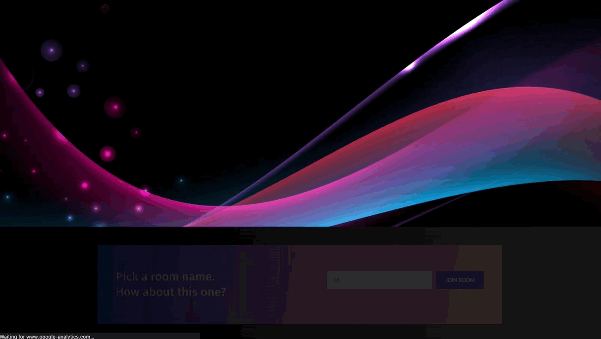

# <p align="center">MiroTalk P2P</p>

<p align="center">Free WebRTC - P2P - Simple, Secure, Fast Real-Time Video Conferences Up to 4k and 60fps, compatible with all browsers and platforms.</p>

<hr />

<p align="center">
    <a href="https://p2p.mirotalk.com">p2p.mirotalk.com</a>
</p>

<hr />

<p align="center">
    <a href="https://p2p.mirotalk.com"></a>
</p>

<hr />

<details>
<summary>Features</summary>

<br/>

-   Is `100% Free` - `Open Source` - `Self Hosted` and [PWA](https://en.wikipedia.org/wiki/Progressive_web_application)!
-   No download, plug-in, or login required, entirely browser-based
-   Unlimited number of conference rooms without call time limitation
-   Translated in 133 languages
-   Host protection to ensure unauthorized access to your host
-   Possibility to Password protect the Room for the meeting
-   Desktop and Mobile compatible
-   Optimized Room URL Sharing for mobile
-   Webcam Streaming (Front - Rear for mobile)
-   Audio Streaming crystal clear with detect speaking and volume indicator
-   Screen Sharing to present documents, slides, and more...
-   File Sharing (with drag-and-drop), share any files to your participants in the room
-   Select Audio Input - Output and Video source
-   Ability to set video quality up to 4K and 60 FPS
-   Recording your Screen, Audio and Video
-   Snapshot the video frame and save it as image png
-   Chat with Emoji Picker to show you feeling, private messages, Markdown support, possibility to Save the conversations, and many more
-   ChatGPT (openAI), designed to answer users' questions, provide relevant information, and connect them with relevant resources
-   Speech recognition to send the speeches
-   Push to talk, like a walkie-talkie.
-   Advance collaborative whiteboard for the teachers
-   Share any YT Embed video, video mp4, webm, ogg and audio mp3 in real-time
-   Full-Screen Mode on mouse click on the Video element, Pin/Unpin, Zoom in-out video element
-   Possibility to Change UI Themes
-   Right-click on the Video elements for more options
-   Direct `peer-to-peer` connection ensures the lowest latency thanks to `WebRTC`
-   Supports [REST API](app/api/README.md) (Application Programming Interface)
-   [Slack](https://api.slack.com/apps/) API integration
-   [Sentry](https://sentry.io/) error reporting
-   ...

</details>

<details>
<summary>About</summary>

-   [Presentation](https://www.canva.com/design/DAE693uLOIU/view)

-   [Video](https://www.youtube.com/watch?v=_IVn2aINYww)

</details>

<details>
<summary>Start videoconference</summary>

<br/>

-   `Open` https://p2p.mirotalk.com/newcall or
-   https://mirotalk.up.railway.app/newcall or
-   https://mirotalk.herokuapp.com/newcall
-   `Pick` your Room name and Join
-   `Allow` using the camera and microphone
-   `Share` the Room URL and Wait for someone to join for the video conference

</details>

<details>
<summary>Direct Join</summary>

<br/>

-   You can `join` directly to `room` by going to:
-   https://p2p.mirotalk.com/join?room=test&name=mirotalk&audio=0&video=0&screen=0&notify=0
-   https://mirotalk.up.railway.app/join?room=test&name=mirotalk&audio=0&video=0&screen=0&notify=0
-   https://mirotalk.herokuapp.com/join?room=test&name=mirotalk&audio=0&video=0&screen=0&notify=0

    | Params | Type    | Description     |
    | ------ | ------- | --------------- |
    | room   | string  | room Id         |
    | name   | string  | user name       |
    | audio  | boolean | audio stream    |
    | video  | boolean | video stream    |
    | screen | boolean | screen stream   |
    | notify | boolean | welcome message |

</details>

<details>
<summary>Embed a meeting</summary>

<br/>

Embedding a meeting into a service or app using an iframe.

```html
<iframe
    allow="camera; microphone; display-capture; fullscreen; clipboard-read; clipboard-write; autoplay"
    src="https://p2p.mirotalk.com/newcall"
    style="height: 100%; width: 100%; border: 0px;"
></iframe>
```

</details>

<details open>
<summary>Quick start</summary>

<br/>

-   You will need to have `Node.js` installed, this project has been tested with Node versions [12.X](https://nodejs.org/en/blog/release/v12.22.1/), [14.X](https://nodejs.org/en/blog/release/v14.17.5/), [16.X](https://nodejs.org/en/blog/release/v16.15.1/) and [18.x](https://nodejs.org/en/blog/release/v18.16.0).

```bash
# clone this repo
$ git clone https://github.com/miroslavpejic85/mirotalk.git
# go to mirotalk dir
$ cd mirotalk
# copy .env.template to .env (edit it according to your needs)
$ cp .env.template .env
# install dependencies
$ npm install
# start the server
$ npm start
```

-   Open http://localhost:3000 in browser

</details>

<details open>
<summary>Docker</summary>

<br/>


-   Install docker engine: https://docs.docker.com/engine/install/
-   Install docker compose: https://docs.docker.com/compose/install/
-   Repository docker hub: https://hub.docker.com/r/mirotalk/p2p

```bash
# copy .env.template to .env (edit it according to your needs)
$ cp .env.template .env
# Copy docker-compose.template.yml in docker-compose.yml (edit it according to your needs)
$ cp docker-compose.template.yml docker-compose.yml
# Get official image from Docker Hub
$ docker pull mirotalk/p2p:latest
# create and start containers
$ docker-compose up # -d
# to stop and remove resources
$ docker-compose down
```

-   Open http://localhost:3000 in browser

</details>

<details>
<summary>Ngrok - Https</summary>

<br/>

You can start videoconferencing directly from your Local PC, and be reachable from any device outside your network, simply by reading [these documentation](docs/ngrok.md), or expose it directly on [HTTPS](app/ssl/README.md)

</details>

<details>
<summary>Stun & Turn</summary>

<br/>

Install your own [Stun](https://en.wikipedia.org/wiki/STUN) & [Turn](https://en.wikipedia.org/wiki/TURN) by following [this steps](./docs/coturn.md).

</details>

<details>
<summary>Rest API</summary>

<br/>

```bash
# The response will give you a entrypoint / Room URL for your meeting, where authorization: API_KEY_SECRET.
$ curl -X POST "http://localhost:3000/api/v1/meeting" -H "authorization: mirotalk_default_secret" -H "Content-Type: application/json"
$ curl -X POST "https://p2p.mirotalk.com/api/v1/meeting" -H "authorization: mirotalk_default_secret" -H "Content-Type: application/json"
$ curl -X POST "https://mirotalk.up.railway.app/api/v1/meeting" -H "authorization: mirotalk_default_secret" -H "Content-Type: application/json"
$ curl -X POST "https://mirotalk.herokuapp.com/api/v1/meeting" -H "authorization: mirotalk_default_secret" -H "Content-Type: application/json"
```

## API Documentation

The API documentation uses [swagger](https://swagger.io/) at http://localhost:3000/api/v1/docs. Or check it out on [live](https://p2p.mirotalk.com/api/v1/docs) & [heroku](https://mirotalk.herokuapp.com/api/v1/docs).

</details>

<details open>
<summary>Hetzner</summary>

<br/>

[](https://hetzner.cloud/?ref=XdRifCzCK3bn)

This application is running for `demonstration purposes` on [Hetzner](https://www.hetzner.com/), one of `the best` [cloud providers](https://www.hetzner.com/cloud) and [dedicated root servers](https://www.hetzner.com/dedicated-rootserver).

---

Use [my personal link](https://hetzner.cloud/?ref=XdRifCzCK3bn) to receive `€⁠20 IN CLOUD CREDITS`.

---

If you need help to deploy `MiroTalk P2P` instance on `your dedicated cloud server`, or for other needs, don't hesitate to contact us at p2p.mirotalk@gmail.com

</details>

<details>
<summary>Live Demos</summary>

<br/>

<a target="_blank" href="https://p2p.mirotalk.com"></a>

https://p2p.mirotalk.com

[](https://p2p.mirotalk.com)

<br>

<a target="_blank" href="https://railway.app/new/template/mirotalk?referralCode=mirotalk"></a>

https://mirotalk.up.railway.app

[](https://mirotalk.up.railway.app)

<br>

<a href="https://heroku.com/deploy?template=https://github.com/miroslavpejic85/mirotalk"></a>

https://mirotalk.herokuapp.com

[](https://mirotalk.herokuapp.com)

If you want to deploy a MiroTalk P2P instance on your dedicated server, or for other needs, don't hesitate to contact us at p2p.mirotalk@gmail.com.

</details>

<details>
<summary>Self Hosting</summary>

<br/>

To `Self-Host MiroTalk P2P` on `Your` dedicated `Server`, read [this documentation](docs/self-hosting.md).

</details>

<details>
<summary>Security</summary>

<br/>

For `Security` concerning, please follow [this documentation](./SECURITY.md).

</details>

<details>
<summary>Credits</summary>

<br/>

-   ianramzy (html [template](https://cruip.com/demos/neon/))
-   vasanthv (webrtc-logic)
-   fabric.js (whiteboard)

</details>

<details>
<summary>Contributing</summary>

<br/>

-   Contributions are welcome and greatly appreciated!
-   Just run before `npm run lint`

</details>

<details>
<summary>Questions, Discussions and support</summary>

<br/>

-   For questions, discussions, help & support, join with us on [Discord](https://discord.gg/rgGYfeYW3N)

</details>

<details>
<summary>License</summary>

<br/>

[](LICENSE)

MiroTalk is free and can be modified and forked. But the conditions of the AGPLv3 (GNU Affero General Public License v3.0) need to be respected. In particular modifications need to be free as well and made available to the public. Get a quick overview of the license at [Choose an open source license](https://choosealicense.com/licenses/agpl-3.0/).

For a MiroTalk license under conditions other than AGPLv3, please contact us at license.mirotalk@gmail.com or [purchase directly from CodeCanyon](https://codecanyon.net/item/mirotalk-p2p-webrtc-realtime-video-conferences/38376661).

</details>

<details open>
<summary>Support the project</summary>

<br/>

Do you find MiroTalk useful?

Support the project by [becoming a backer or sponsor](https://github.com/sponsors/miroslavpejic85). Your logo will show up here with a link to your website.

|                                                                                   |                                                                                    |
| --------------------------------------------------------------------------------- | ---------------------------------------------------------------------------------- |
| [](https://broadcastx.de/)           | [](https://hetzner.cloud/?ref=XdRifCzCK3bn) |
| [](https://luvlounge.ca)               | [](https://www.questionpro.com)     |
| [](https://www.browserstack.com) |                                                                                    |

</details>

<br>

<details>
<summary>MiroTalk SFU</summary>

<br/>

Try also [MiroTalk SFU](https://github.com/miroslavpejic85/mirotalksfu), the difference between the two projects you can found [here](https://github.com/miroslavpejic85/mirotalksfu/issues/14#issuecomment-932701999).

</details>

<details>
<summary>MiroTalk C2C</summary>

<br>

Try also [MiroTalk C2C](https://github.com/miroslavpejic85/mirotalkc2c) cam 2 cam.

</details>

<details>
<summary>MiroTalk WEB</summary>

<br>

Try also [MiroTalk WEB](https://github.com/miroslavpejic85/mirotalkwebrtc) rooms scheduler.

</details>

This project is tested with [BrowserStack](https://www.browserstack.com).
