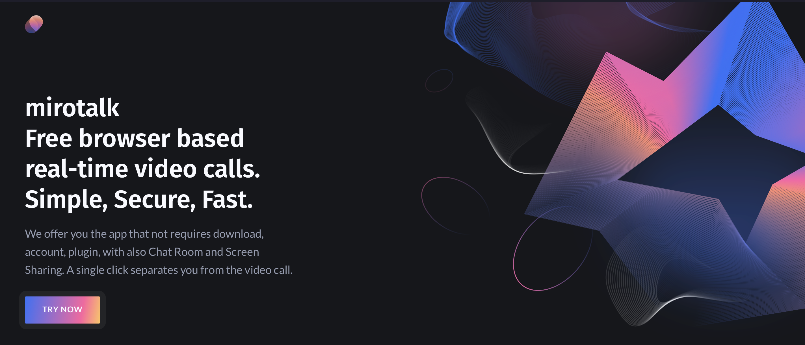
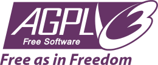

# MiroTalk

🚀 `A free WebRTC browser-based video call, chat and screen sharing` 🚀

<br>

[//]: https://img.shields.io/badge/<LABEL>-<MESSAGE>-<COLOR>

[](https://www.linkedin.com/in/miroslav-pejic-976a07101/)

[](https://paypal.me/MiroslavPejic?locale.x=it_IT)
[](https://github.com/miroslavpejic85/mirotalk)
[](https://github.com/prettier/prettier)
[](https://gitter.im/mirotalk/community?utm_source=badge&utm_medium=badge&utm_campaign=pr-badge)
[](https://discord.gg/TAeWXJCvBr)

Powered by `WebRTC` using google Stun and [numb](http://numb.viagenie.ca/) Turn. `MiroTalk` provides video quality and latency not available with traditional technology.

Open the app with the following **supported browsers** & many more...

[//]: #

[](https://mirotalk.herokuapp.com/)

## https://mirotalk.herokuapp.com/

<br>

[](https://mirotalk.herokuapp.com/)

## Features

-   Is `100% Free` and `Open Source`
-   No download, plug-in or login required, entirely browser based
-   Unlimited number of conference rooms without call time limitation
-   Possibility to Lock/Unlock the Room for the meeting
-   Desktop and Mobile compatible
-   Optimized Room URL Sharing (share it to your participants, wait them to join)
-   Webcam Streaming (Front - Rear for mobile)
-   Audio Streaming crystal clear
-   Screen Sharing to present documents, slides, and more...
-   File Sharing, share any files to your participants in the room
-   Select Audio Input - Output && Video source
-   Ability to set video quality up to 4K and adapt the FPS
-   Recording your Screen, Audio and Video
-   Chat with Emoji Picker & Private messages & Save the conversations
-   Simple collaborative whiteboard for the teachers
-   Share any YouTube video in real time
-   Start a tetris game in waiting your participants :)
-   Full Screen Mode on mouse click on the Video element
-   Possibility to Change UI Themes
-   Right-click on the Video elements for more options
-   Direct `peer-to-peer` connection ensures the lowest latency thanks to `WebRTC`
-   Supports [REST API](api/README.md) (Application Programming Interface)

## Demo

-   `Open` https://mirotalk.up.railway.app/newcall `or` https://mirotalk.herokuapp.com/newcall
-   `Pick` your personal Room name and `Join To Room`
-   `Allow` to use the camera and microphone
-   `Share` the Room URL and `Wait` someone to join for video conference

## Room join

-   You can also `join` directly to your `room` by going to https://mirotalk.up.railway.app/join/your-room-name-goes-here `or` https://mirotalk.herokuapp.com/join/your-room-name-goes-here

## Quick start

-   You will need to have `Node.js` installed, this project has been tested with Node version [12.X](https://nodejs.org/en/blog/release/v12.22.1/) and [14.X](https://nodejs.org/en/blog/release/v14.17.5/)

```bash
# clone this repo
$ git clone https://github.com/miroslavpejic85/mirotalk.git
# go to mirotalk dir
$ cd mirotalk
# copy .env.template to .env
$ cp .env.template .env
# install dependencies
$ npm install
# start the server
$ npm start
```

-   Open http://localhost:3000 in browser

---

## Docker

-   Install https://docs.docker.com/compose/install/

```bash
# copy .env.template to .env
$ cp .env.template .env
# build or rebuild services
$ docker-compose build
# create and start containers
$ docker-compose up # -d
# stop and remove resources
$ docker-compose down
```

-   Open http://localhost:3000 in browser

---

## API

```bash
# The response will give you a entrypoint / Room URL for your meeting, where authorization: API_KEY_SECRET.
$ curl -X POST "http://localhost:3000/api/v1/meeting" -H "authorization: mirotalk_default_secret" -H "Content-Type: application/json"
$ curl -X POST "https://mirotalk.up.railway.app/api/v1/meeting" -H "authorization: mirotalk_default_secret" -H "Content-Type: application/json"
$ curl -X POST "https://mirotalk.herokuapp.com/api/v1/meeting" -H "authorization: mirotalk_default_secret" -H "Content-Type: application/json"
```

## API Documentation

The API documentation uses [swagger](https://swagger.io/) at http://localhost:3000/api/v1/docs. Or check it out on [railway](https://mirotalk.up.railway.app/api/v1/docs) & [heroku](https://mirotalk.herokuapp.com/api/v1/docs).

---

If you want `MiroTalk` to be `reachable` from the `outside` of your local network, you can use a service like [ngrok](https://ngrok.com/) (by editing the `Ngrok` part on `.env` file) or expose it directly on [https](ssl/README.md) or deploy it on:

<br>

[](https://www.heroku.com/)

`demo` https://mirotalk.herokuapp.com/

[](https://mirotalk.herokuapp.com/)

<br>

[](https://railway.app)

`demo` https://mirotalk.up.railway.app/

[](https://mirotalk.up.railway.app/)

---

## Credits

Many Thanks to:

-   ianramzy (html [template](https://cruip.com/demos/neon/))
-   vasanthv (webrtc)
-   Sajad (chat)
-   i-aryan (whiteboard)
-   fmeringdal (rest api)

From where I took inspiration for this project. ❤️

## Contributing

-   Pull Requests are very welcome! :slightly_smiling_face:
-   Just run [prettier](https://prettier.io) on all of your PRs before submitting, this can be done with the following comand: `npm run lint`

-   For communication we use [gitter](https://gitter.im/) or [discord](https://discord.com/) chats which can be found here:

[](https://gitter.im/mirotalk/community?utm_source=badge&utm_medium=badge&utm_campaign=pr-badge) [](https://discord.gg/TAeWXJCvBr)

## License

[](LICENSE)

---

<p align="center"> Made with ❤️ by <a href="https://www.linkedin.com/in/miroslav-pejic-976a07101/">Miroslav Pejic</a></p>
