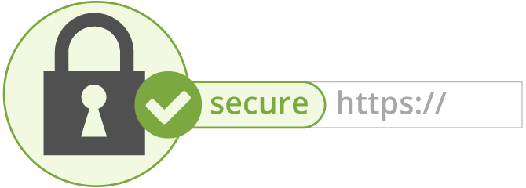

## Expose MiroTalk on HTTPS



1. Generate a [self-signed certificate](https://en.wikipedia.org/wiki/Self-signed_certificate)

```bash
# install openssl 4 ubuntu
apt install openssl
# install openssl 4 mac
brew install openssl

# self-signed certificate
openssl genrsa -out key.pem
openssl req -new -key key.pem -out csr.pem
openssl x509 -req -days 9999 -in csr.pem -signkey key.pem -out cert.pem
rm csr.pem

# https://www.sslchecker.com/certdecoder
```

2. Expose `server.js` on `https` using the self-signed certificate, edit the `.env` file

```bash
HTTPS=true
```
