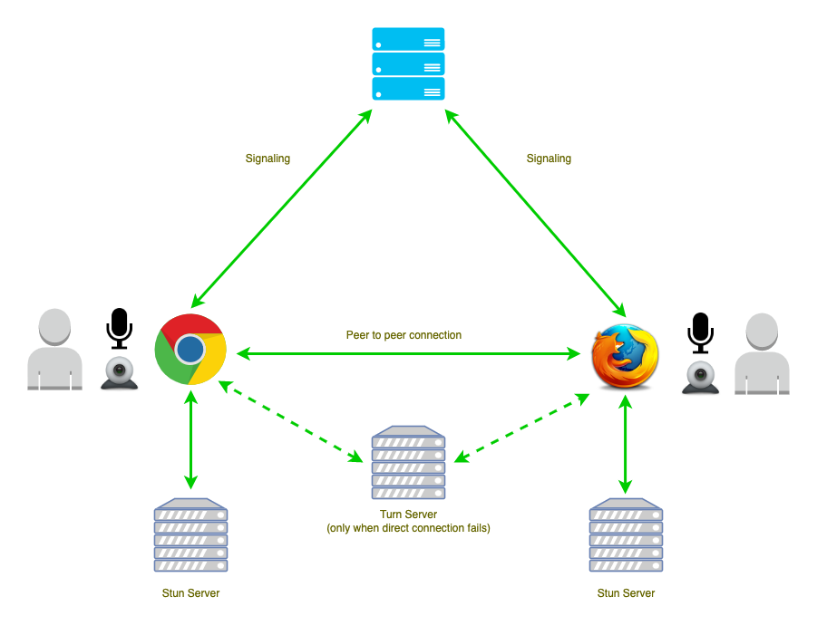

# Install Coturn STUN/TURN server



## Requirements

-   Recommended: [Hetzner](https://www.hetzner.com/cloud) (`CPX11` it's enough, OS: `Ubuntu 20.04 LTS / 22.04.1 LTS`).
-   Use [my personal link](https://hetzner.cloud/?ref=XdRifCzCK3bn) to receive `€⁠20 in cloud credits`.
-   Your domain name, example: `your.domain.name`
    -   Set a DNS A record for that domain that point to Your Server public IPv4
        > DNS A Record: The Address Mapping record (or DNS host record) stores a hostname and its corresponding IPv4 address. When users search for your website, the A record redirects this traffic from the web address (xxxxx.com – human-readable domain) to the IPv4 address.
-   `your.username` and `your.password` to set in the `/etc/turnserver.conf`.
-   [Certbot](https://certbot.eff.org/) to generate `cert` & `pkey`.

## Quick start

1. Download [coturn](https://github.com/coturn/coturn)

```bash
$ sudo apt-get -y update
$ sudo apt-get -y install coturn
```

2. Uncomment the following line to run Coturn as an automatic system service daemon in `/etc/default/coturn`

```ini
TURNSERVER_ENABLED=1
```

3. Set `/etc/turnserver.conf` to the following:

```ini
listening-port=3478
tls-listening-port=5349

min-port=10000
max-port=20000

fingerprint
lt-cred-mech

user=your.username:your.password

server-name=your.domain.name
realm=your.domain.name

total-quota=100
stale-nonce=600

cert=/etc/letsencrypt/live/your.domain.name/fullchain.pem
pkey=/etc/letsencrypt/live/your.domain.name/privkey.pem
cipher-list="ECDHE-RSA-AES256-GCM-SHA512:DHE-RSA-AES256-GCM-SHA512:ECDHE-RSA-AES256-GCM-SHA384:DHE-RSA-AES256-GCM-SHA384:ECDHE-RSA-AES256-SHA384"

no-stdout-log
```

4. If you can't reach coturn on `tls-listening-port`, try to edit `/etc/systemd/system/multi-user.target.wants/coturn.service`

```ini
[Service]
User=root
Group=root
```

5. Reload daemon:

```bash
$ sudo systemctl daemon-reload
```

## Coturn commands

```bash
$ sudo service coturn status
$ sudo service coturn stop
$ sudo service coturn start
$ sudo service coturn restart
```

# Test

Test if it's working:

-   https://webrtc.github.io/samples/src/content/peerconnection/trickle-ice/
-   https://icetest.info/

Or use the built in MiroTalk P2P service, just change `your.domain.name`, `your.username` and `your.password` with your own, in the following urls:

-   https://p2p.mirotalk.com/test?iceServers=[{"urls":"stun:your.domain.name:3478"},{"urls":"turn:your.domain.name:3478","username":"your.username","credential":"your.password"}]

-   https://p2p.mirotalk.com/test?iceServers=[{"urls":"stun:your.domain.name:5349"},{"urls":"turn:your.domain.name:5349","username":"your.username","credential":"your.password"}]
